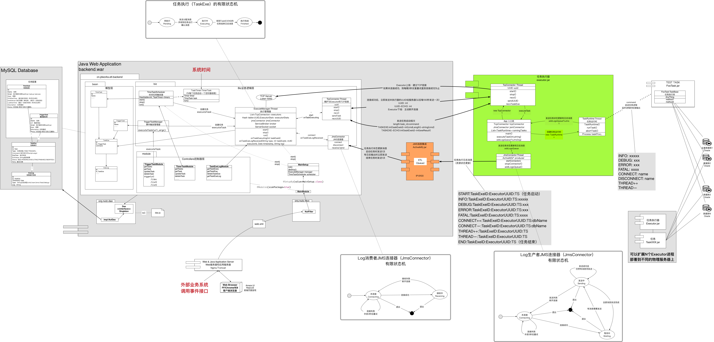

# ETL 数据抽取、加载、转换工具

# All projects are build with Maven

It's better to configure maven Chinese mirror to speed up downloading when first time execute 'mvn package'

Edit（%MAVEN_HOME%\conf\settings.xml), Find <mirrors> node, add following mirror: 

    <mirror>
        <id>repo2</id>
        <mirrorOf>central</mirrorOf>
        <name>Human Readable Name for this Mirror.</name>
        <url>http://repo2.maven.org/maven2/</url>
    </mirror>
    <mirror>
        <id>net-cn</id>
        <mirrorOf>central</mirrorOf>
        <name>Human Readable Name for this Mirror.</name>
        <url>http://maven.net.cn/content/groups/public/</url>
    </mirror>
    <mirror>
        <id>ui</id>
        <mirrorOf>central</mirrorOf>
        <name>Human Readable Name for this Mirror.</name>
        <url>http://uk.maven.org/maven2/</url>
    </mirror>
    <mirror>
        <id>ibiblio</id>
        <mirrorOf>central</mirrorOf>
        <name>Human Readable Name for this Mirror.</name>
        <url>http://mirrors.ibiblio.org/pub/mirrors/maven2/</url>
    </mirror>
    <mirror>
        <id>jboss-public-repository-group</id>
        <mirrorOf>central</mirrorOf>
        <name>JBoss Public Repository Group</name>
        <url>http://repository.jboss.org/nexus/content/groups/public</url>
    </mirror>
    <mirror>
        <id>skynet.be</id>
        <url>http://maven2.mirrors.skynet.be/pub/maven2</url>
        <mirrorOf>central</mirrorOf>
    </mirror>
    <mirror>
        <id>cica.es</id>
        <url>http://ftp.cica.es/mirrors/maven2</url>
        <mirrorOf>central</mirrorOf>
    </mirror>
    <mirror>
        <id>ibiblio.org</id>
        <name>ibiblio Mirror of http://repo1.maven.org/maven2/</name>
        <url>http://mirrors.ibiblio.org/pub/mirrors/maven2</url>
        <mirrorOf>central</mirrorOf>
    </mirror>

# backend

  web项目

# executor

  执行器项目

# protocol

  backend和executor之间JMS通信的协议类

# 系统设计

